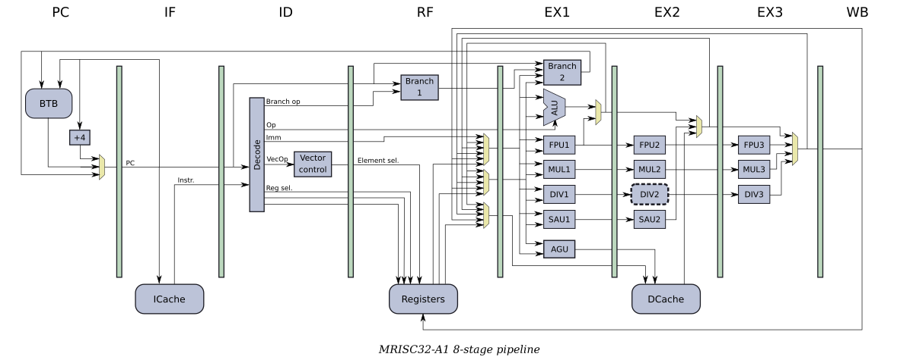

# MRISC32-A1

This is a [VHDL](https://en.wikipedia.org/wiki/VHDL) implementation of a single issue, in-order CPU. The working name for the CPU is *MRISC32-A1*.

## Overview

## Progress

The CPU is still under development. So far, the following components have been implemented:

* An 8-stage pipeline.
  - PC and branching logic.
  - Instruction fetch.
  - Decode.
  - Register fetch.
  - Execute.
  - Data read/write logic (scalar and vector).
  - Register write-back.
  - Operand forwarding.
* The integer ALU.
  - Supports all packed and unpacked integer ALU operations.
  - All ALU operations finish in one cycle.
* A pipelined (three-cycle) integer multiply unit.
  - Supports all packed and unpacked integer multiplication operations.
* A semi-pipelined integer division unit.
  - 15 cycles stall for 32-bit division.
  - 7 cycles stall for 2 x 16-bit division.
  - 3 cycles stall for 4 x 8-bit division.
* A pipelined (two-cycle) Saturating Arithmetic Unit (SAU).
  - Supports all packed and unpacked saturating and halving arithmetic instructions.
* An FPU.
  - Currently only a subset of all the FPU instructions is implemented.
* The scalar register file.
  - There are three read ports and one write port.
* The vector register file.
  - There are two read ports and one write port.
  - Each vector register has 16 elements.
* An address generation unit (AGU).
  - The AGU supports all [addressing modes](../doc/AddressingModes.md).
* Branch prediction and correction.
  - The branch misprediction penalty is 3 cycles.

**TODO**: Caches, more FPU instrucions, etc.

## Preformance

The MRISC32-A1 can issue **one operation per clock cycle**.

When synthesized against an [Intel Cyclone V FPGA](https://www.intel.com/content/www/us/en/products/programmable/fpga/cyclone-v.html), the maximum running frequency is around **100 MHz**.

